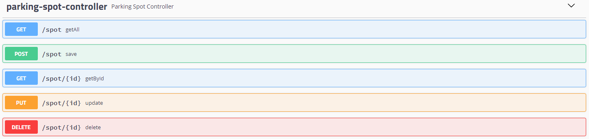

## Tech Control 🧑‍💻
>Status: Desenvolvido ✅

### O Tech Control é uma aplicação para controle de vagas de condominio, cada apartamento/carro possui uma vaga especifica. O projeto foi desenvolvido para aprender e aperfeiçoar conceitos importantes.
### O projeto tem uma classe com várias funcionalidades, destaque para a configuração global de data, validações e inclusão do Swagger para melhorar documentação.
### A aplicação foi desenvolvida inspirado no video da Michelli Brito da Decoder

## Technologies

+ JAVA 11
+ Spring Boot 
+ JPA / Hibernate
+ Maven
+ PostgreSQL

## Entity / Model
### ParkingSpot
+ UUID id
+ String ParkingSpotNumber
+ String licensePlateCar
+ String brandCar
+ String modelCar
+ String colorCar
+ LocalDateTime registrationDate
+ String responsibleName
+ String apartment
+ String block

## Endpoints


## Como rodar o projeto
### Pré-requisito
+JAVA 11
+IDE (de sua preferencia)
+Postegres

### Rodando o projeto
+ Clone esse repositório em seu computador (Comando para utilizar no CMD: ```git clone https://github.com/chavesluucas/GoDev.git```)
+ Importe o projeto para dentro de sua IDE
+ Crie uma database com o nome de "parking-control-db"
+ Rode o projeto dentro de sua IDE

#### Para acessar o swagger, em seu navegador com o projeto rodando na IDE acesse [url]/swagger-ui.html.
#### Para utilizar os endpoints, utilizar ferramenta de requisições, como Postman, Insomnia entre outras ferramentas.

## Bonus
Eu tenho um site pessoal que desenvovi em ReactJS, caso queria me conhecer melhor basta <a href="https://lucaschaves.tech" target="_blank">clicar aqui<a>
